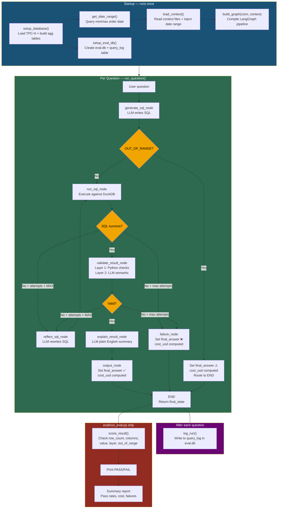

# Data Flow

```mermaid
flowchart TD
    subgraph startup["Startup — runs once"]
        A["setup_database()\nLoad TPC-H + build agg tables"] --> B["get_date_range()\nQuery min/max order date"]
        B --> C["load_context()\nRead context files + inject date range"]
        C --> D["build_graph(conn, context)\nCompile LangGraph pipeline"]
        A --> E["setup_eval_db()\nCreate eval.db + query_log table"]
    end

    subgraph per_question["Per Question — run_question()"]
        F["User question"] --> G["generate_sql_node\nLLM writes SQL"]
        G --> H{OUT_OF_RANGE?}
        H -->|Yes| I["Set final_answer ⚠️\ncost_usd computed\nRoute to END"]
        H -->|No| J["run_sql_node\nExecute against DuckDB"]
        J --> K{SQL success?}
        K -->|No + attempts < MAX| L["reflect_sql_node\nLLM rewrites SQL"]
        L --> J
        K -->|No + max attempts| M["failure_node\nSet final_answer ❌\ncost_usd computed"]
        K -->|Yes| N["validate_result_node\nLayer 1: Python checks\nLayer 2: LLM semantic"]
        N --> O{Valid?}
        O -->|No + attempts < MAX| L
        O -->|No + max attempts| M
        O -->|Yes| P["explain_result_node\nLLM plain English summary"]
        P --> Q["output_node\nSet final_answer ✅\ncost_usd computed"]
        Q --> R["END\nReturn final_state"]
        M --> R
        I --> R
    end

    subgraph logging["After each question"]
        R --> S["log_run()\nWrite to query_log in eval.db"]
    end

    subgraph eval_path["eval/run_eval.py only"]
        R --> T["score_result()\nCheck row_count, columns,\nvalue, layer, out_of_range"]
        T --> U["Print PASS/FAIL"]
        U --> V["Summary report\nPass rates, cost, failures"]
    end

    startup --> per_question

    style startup fill:#1a5276,color:#fff
    style per_question fill:#2d6a4f,color:#fff
    style logging fill:#6a0572,color:#fff
    style eval_path fill:#922b21,color:#fff
    style H fill:#f0a500,color:#000
    style K fill:#f0a500,color:#000
    style O fill:#f0a500,color:#000
```
