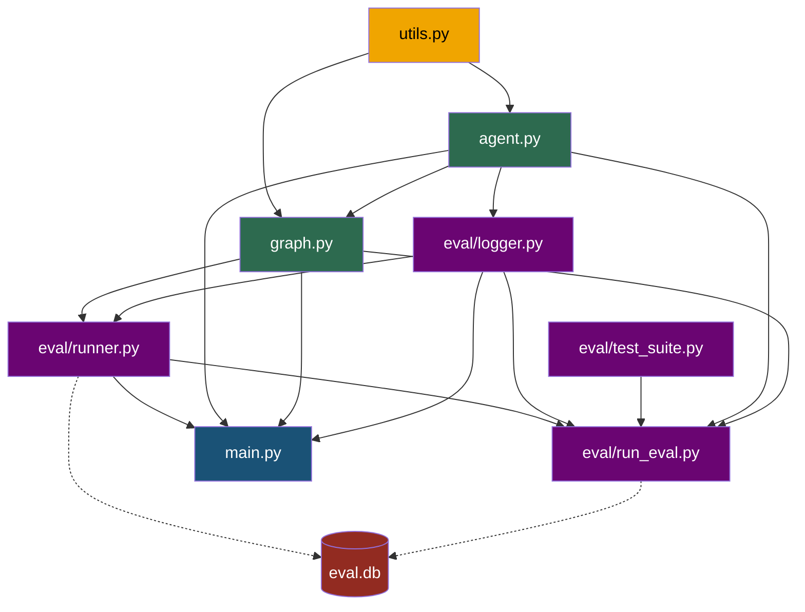

# File Dependency

```mermaid
flowchart TD
    utils["utils.py"]
    agent_py["agent.py"]
    graph_py["graph.py"]
    logger_py["eval/logger.py"]
    runner_py["eval/runner.py"]
    test_suite_py["eval/test_suite.py"]
    run_eval_py["eval/run_eval.py"]
    main_py["main.py"]
    evaldb[("eval.db")]

    utils --> agent_py
    utils --> graph_py
    agent_py --> graph_py
    agent_py --> logger_py
    graph_py --> runner_py
    logger_py --> runner_py
    runner_py --> main_py
    runner_py --> run_eval_py
    logger_py --> run_eval_py
    test_suite_py --> run_eval_py
    agent_py --> run_eval_py
    graph_py --> run_eval_py
    agent_py --> main_py
    graph_py --> main_py
    logger_py --> main_py
    runner_py -.-> evaldb
    run_eval_py -.-> evaldb

    style utils fill:#f0a500,color:#000
    style agent_py fill:#2d6a4f,color:#fff
    style graph_py fill:#2d6a4f,color:#fff
    style logger_py fill:#6a0572,color:#fff
    style runner_py fill:#6a0572,color:#fff
    style test_suite_py fill:#6a0572,color:#fff
    style run_eval_py fill:#6a0572,color:#fff
    style main_py fill:#1a5276,color:#fff
    style evaldb fill:#922b21,color:#fff
```